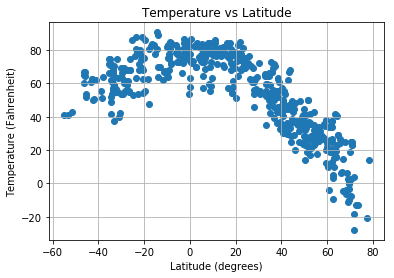

```python
#Observable Trends:
    #1 - Temperature heavily correlates with latitude. It is generally hotter near the equator, and  colder near the poles.
    #    There are not many outliers here, as the graph follows a pretty steady curve.
    
    #2 - Near the equator, humidity levels tend to stay close to 100. Outside of that range, there is little correlation.
    
    #3 - Outside of extreme winds near the poles, latitude appears to have zero correlation with wind speed and cloud cover. 
```


```python
#dependencies
from config import api_key
from citipy import citipy
import json
import requests
import csv
import random
import numpy as np
import pandas as pd
import matplotlib.pyplot as plt
```


```python
#building base query url
url=f"http://api.openweathermap.org/data/2.5/weather?appid={api_key}&units=imperial&q="
```


```python
namelist=[]
dataframe = pd.DataFrame(columns=["City Name", "Latitude", "Longitude", "Temperature", "Humidity", "Clouds", "Wind"])
x=0
while 1: #fills the base dataframe with random latitudes and longitudes
    if len(namelist)<500:
        lat= (random.random()* 180) - 90 #returns a random latitude- any number from -90 to +90
        lon= (random.random()* 360) - 180 #returns a random longitude- any number from -180 to +180
        name = str(citipy.nearest_city(lat,lon).city_name)
        try: #in case a city name from citipy is not recognized by open weather map
            if name not in namelist: #makes sure that no cities are repeated
                response = requests.get(url+name).json()
                dataframe.loc[x,"City Name"] = response["name"]
                dataframe.loc[x,"Latitude"] = response["coord"]["lat"]
                dataframe.loc[x,"Longitude"] = response["coord"]["lon"]
                dataframe.loc[x,"Temperature"] = response["main"]["temp"]
                dataframe.loc[x,"Humidity"] = response["main"]["humidity"]
                dataframe.loc[x,"Clouds"] = response["clouds"]["all"]
                dataframe.loc[x,"Wind"] = response["wind"]["speed"]
                print("PROCESSING: ", x, name, url+name)
                x=x+1
                namelist.append(name)
                
        except:
            print("")
    else:
        break

```

    PROCESSING:  0 bandarbeyla http://api.openweathermap.org/data/2.5/weather?appid=92baac03b88e84bd41c2d96c03ab5f36&units=imperial&q=bandarbeyla
    PROCESSING:  1 pangkalanbuun http://api.openweathermap.org/data/2.5/weather?appid=92baac03b88e84bd41c2d96c03ab5f36&units=imperial&q=pangkalanbuun
    PROCESSING:  2 bar harbor http://api.openweathermap.org/data/2.5/weather?appid=92baac03b88e84bd41c2d96c03ab5f36&units=imperial&q=bar harbor
    PROCESSING:  3 bredasdorp http://api.openweathermap.org/data/2.5/weather?appid=92baac03b88e84bd41c2d96c03ab5f36&units=imperial&q=bredasdorp
    PROCESSING:  4 dikson http://api.openweathermap.org/data/2.5/weather?appid=92baac03b88e84bd41c2d96c03ab5f36&units=imperial&q=dikson
    PROCESSING:  5 acapulco http://api.openweathermap.org/data/2.5/weather?appid=92baac03b88e84bd41c2d96c03ab5f36&units=imperial&q=acapulco
    PROCESSING:  6 yulara http://api.openweathermap.org/data/2.5/weather?appid=92baac03b88e84bd41c2d96c03ab5f36&units=imperial&q=yulara
    PROCESSING:  7 bambous virieux http://api.openweathermap.org/data/2.5/weather?appid=92baac03b88e84bd41c2d96c03ab5f36&units=imperial&q=bambous virieux
    
    PROCESSING:  8 bamberg http://api.openweathermap.org/data/2.5/weather?appid=92baac03b88e84bd41c2d96c03ab5f36&units=imperial&q=bamberg
    PROCESSING:  9 vaini http://api.openweathermap.org/data/2.5/weather?appid=92baac03b88e84bd41c2d96c03ab5f36&units=imperial&q=vaini
    PROCESSING:  10 severo-kurilsk http://api.openweathermap.org/data/2.5/weather?appid=92baac03b88e84bd41c2d96c03ab5f36&units=imperial&q=severo-kurilsk
    PROCESSING:  11 punta arenas http://api.openweathermap.org/data/2.5/weather?appid=92baac03b88e84bd41c2d96c03ab5f36&units=imperial&q=punta arenas
    PROCESSING:  12 cape town http://api.openweathermap.org/data/2.5/weather?appid=92baac03b88e84bd41c2d96c03ab5f36&units=imperial&q=cape town
    PROCESSING:  13 mataura http://api.openweathermap.org/data/2.5/weather?appid=92baac03b88e84bd41c2d96c03ab5f36&units=imperial&q=mataura
    PROCESSING:  14 taloqan http://api.openweathermap.org/data/2.5/weather?appid=92baac03b88e84bd41c2d96c03ab5f36&units=imperial&q=taloqan
    PROCESSING:  15 guarapari http://api.openweathermap.org/data/2.5/weather?appid=92baac03b88e84bd41c2d96c03ab5f36&units=imperial&q=guarapari
    PROCESSING:  16 wanning http://api.openweathermap.org/data/2.5/weather?appid=92baac03b88e84bd41c2d96c03ab5f36&units=imperial&q=wanning
    
    PROCESSING:  17 los llanos de aridane http://api.openweathermap.org/data/2.5/weather?appid=92baac03b88e84bd41c2d96c03ab5f36&units=imperial&q=los llanos de aridane
    PROCESSING:  18 victoria http://api.openweathermap.org/data/2.5/weather?appid=92baac03b88e84bd41c2d96c03ab5f36&units=imperial&q=victoria
    PROCESSING:  19 saskylakh http://api.openweathermap.org/data/2.5/weather?appid=92baac03b88e84bd41c2d96c03ab5f36&units=imperial&q=saskylakh
    
    
    PROCESSING:  20 carutapera http://api.openweathermap.org/data/2.5/weather?appid=92baac03b88e84bd41c2d96c03ab5f36&units=imperial&q=carutapera
    PROCESSING:  21 nuevo progreso http://api.openweathermap.org/data/2.5/weather?appid=92baac03b88e84bd41c2d96c03ab5f36&units=imperial&q=nuevo progreso
    PROCESSING:  22 leningradskiy http://api.openweathermap.org/data/2.5/weather?appid=92baac03b88e84bd41c2d96c03ab5f36&units=imperial&q=leningradskiy
    PROCESSING:  23 japura http://api.openweathermap.org/data/2.5/weather?appid=92baac03b88e84bd41c2d96c03ab5f36&units=imperial&q=japura
    PROCESSING:  24 hilo http://api.openweathermap.org/data/2.5/weather?appid=92baac03b88e84bd41c2d96c03ab5f36&units=imperial&q=hilo
    PROCESSING:  25 waingapu http://api.openweathermap.org/data/2.5/weather?appid=92baac03b88e84bd41c2d96c03ab5f36&units=imperial&q=waingapu
    PROCESSING:  26 albany http://api.openweathermap.org/data/2.5/weather?appid=92baac03b88e84bd41c2d96c03ab5f36&units=imperial&q=albany
    PROCESSING:  27 amsterdam http://api.openweathermap.org/data/2.5/weather?appid=92baac03b88e84bd41c2d96c03ab5f36&units=imperial&q=amsterdam
    PROCESSING:  28 atuona http://api.openweathermap.org/data/2.5/weather?appid=92baac03b88e84bd41c2d96c03ab5f36&units=imperial&q=atuona
    PROCESSING:  29 fort-shevchenko http://api.openweathermap.org/data/2.5/weather?appid=92baac03b88e84bd41c2d96c03ab5f36&units=imperial&q=fort-shevchenko
    PROCESSING:  30 jamestown http://api.openweathermap.org/data/2.5/weather?appid=92baac03b88e84bd41c2d96c03ab5f36&units=imperial&q=jamestown
    PROCESSING:  31 thompson http://api.openweathermap.org/data/2.5/weather?appid=92baac03b88e84bd41c2d96c03ab5f36&units=imperial&q=thompson
    PROCESSING:  32 maturin http://api.openweathermap.org/data/2.5/weather?appid=92baac03b88e84bd41c2d96c03ab5f36&units=imperial&q=maturin
    PROCESSING:  33 ayan http://api.openweathermap.org/data/2.5/weather?appid=92baac03b88e84bd41c2d96c03ab5f36&units=imperial&q=ayan
    PROCESSING:  34 kilembe http://api.openweathermap.org/data/2.5/weather?appid=92baac03b88e84bd41c2d96c03ab5f36&units=imperial&q=kilembe
    
    PROCESSING:  35 la cruz http://api.openweathermap.org/data/2.5/weather?appid=92baac03b88e84bd41c2d96c03ab5f36&units=imperial&q=la cruz
    PROCESSING:  36 boende http://api.openweathermap.org/data/2.5/weather?appid=92baac03b88e84bd41c2d96c03ab5f36&units=imperial&q=boende
    PROCESSING:  37 east london http://api.openweathermap.org/data/2.5/weather?appid=92baac03b88e84bd41c2d96c03ab5f36&units=imperial&q=east london
    PROCESSING:  38 rikitea http://api.openweathermap.org/data/2.5/weather?appid=92baac03b88e84bd41c2d96c03ab5f36&units=imperial&q=rikitea
    PROCESSING:  39 ushuaia http://api.openweathermap.org/data/2.5/weather?appid=92baac03b88e84bd41c2d96c03ab5f36&units=imperial&q=ushuaia
    PROCESSING:  40 naze http://api.openweathermap.org/data/2.5/weather?appid=92baac03b88e84bd41c2d96c03ab5f36&units=imperial&q=naze
    PROCESSING:  41 beringovskiy http://api.openweathermap.org/data/2.5/weather?appid=92baac03b88e84bd41c2d96c03ab5f36&units=imperial&q=beringovskiy
    PROCESSING:  42 farmington http://api.openweathermap.org/data/2.5/weather?appid=92baac03b88e84bd41c2d96c03ab5f36&units=imperial&q=farmington
    PROCESSING:  43 bobon http://api.openweathermap.org/data/2.5/weather?appid=92baac03b88e84bd41c2d96c03ab5f36&units=imperial&q=bobon
    PROCESSING:  44 new norfolk http://api.openweathermap.org/data/2.5/weather?appid=92baac03b88e84bd41c2d96c03ab5f36&units=imperial&q=new norfolk
    PROCESSING:  45 butaritari http://api.openweathermap.org/data/2.5/weather?appid=92baac03b88e84bd41c2d96c03ab5f36&units=imperial&q=butaritari
    PROCESSING:  46 hermanus http://api.openweathermap.org/data/2.5/weather?appid=92baac03b88e84bd41c2d96c03ab5f36&units=imperial&q=hermanus
    PROCESSING:  47 hofn http://api.openweathermap.org/data/2.5/weather?appid=92baac03b88e84bd41c2d96c03ab5f36&units=imperial&q=hofn
    PROCESSING:  48 hobart http://api.openweathermap.org/data/2.5/weather?appid=92baac03b88e84bd41c2d96c03ab5f36&units=imperial&q=hobart
    PROCESSING:  49 port hardy http://api.openweathermap.org/data/2.5/weather?appid=92baac03b88e84bd41c2d96c03ab5f36&units=imperial&q=port hardy
    PROCESSING:  50 vitim http://api.openweathermap.org/data/2.5/weather?appid=92baac03b88e84bd41c2d96c03ab5f36&units=imperial&q=vitim
    
    PROCESSING:  51 qaanaaq http://api.openweathermap.org/data/2.5/weather?appid=92baac03b88e84bd41c2d96c03ab5f36&units=imperial&q=qaanaaq
    PROCESSING:  52 salalah http://api.openweathermap.org/data/2.5/weather?appid=92baac03b88e84bd41c2d96c03ab5f36&units=imperial&q=salalah
    PROCESSING:  53 cidreira http://api.openweathermap.org/data/2.5/weather?appid=92baac03b88e84bd41c2d96c03ab5f36&units=imperial&q=cidreira
    
    PROCESSING:  54 busselton http://api.openweathermap.org/data/2.5/weather?appid=92baac03b88e84bd41c2d96c03ab5f36&units=imperial&q=busselton
    PROCESSING:  55 rio gallegos http://api.openweathermap.org/data/2.5/weather?appid=92baac03b88e84bd41c2d96c03ab5f36&units=imperial&q=rio gallegos
    PROCESSING:  56 saint-philippe http://api.openweathermap.org/data/2.5/weather?appid=92baac03b88e84bd41c2d96c03ab5f36&units=imperial&q=saint-philippe
    PROCESSING:  57 hami http://api.openweathermap.org/data/2.5/weather?appid=92baac03b88e84bd41c2d96c03ab5f36&units=imperial&q=hami
    PROCESSING:  58 kapaa http://api.openweathermap.org/data/2.5/weather?appid=92baac03b88e84bd41c2d96c03ab5f36&units=imperial&q=kapaa
    PROCESSING:  59 prince rupert http://api.openweathermap.org/data/2.5/weather?appid=92baac03b88e84bd41c2d96c03ab5f36&units=imperial&q=prince rupert
    PROCESSING:  60 ilulissat http://api.openweathermap.org/data/2.5/weather?appid=92baac03b88e84bd41c2d96c03ab5f36&units=imperial&q=ilulissat
    PROCESSING:  61 bluff http://api.openweathermap.org/data/2.5/weather?appid=92baac03b88e84bd41c2d96c03ab5f36&units=imperial&q=bluff
    PROCESSING:  62 dustlik http://api.openweathermap.org/data/2.5/weather?appid=92baac03b88e84bd41c2d96c03ab5f36&units=imperial&q=dustlik
    PROCESSING:  63 port alfred http://api.openweathermap.org/data/2.5/weather?appid=92baac03b88e84bd41c2d96c03ab5f36&units=imperial&q=port alfred
    PROCESSING:  64 kavaratti http://api.openweathermap.org/data/2.5/weather?appid=92baac03b88e84bd41c2d96c03ab5f36&units=imperial&q=kavaratti
    PROCESSING:  65 petropavlovsk-kamchatskiy http://api.openweathermap.org/data/2.5/weather?appid=92baac03b88e84bd41c2d96c03ab5f36&units=imperial&q=petropavlovsk-kamchatskiy
    PROCESSING:  66 marsh harbour http://api.openweathermap.org/data/2.5/weather?appid=92baac03b88e84bd41c2d96c03ab5f36&units=imperial&q=marsh harbour
    PROCESSING:  67 grand-santi http://api.openweathermap.org/data/2.5/weather?appid=92baac03b88e84bd41c2d96c03ab5f36&units=imperial&q=grand-santi
    PROCESSING:  68 kyshtovka http://api.openweathermap.org/data/2.5/weather?appid=92baac03b88e84bd41c2d96c03ab5f36&units=imperial&q=kyshtovka
    PROCESSING:  69 salobrena http://api.openweathermap.org/data/2.5/weather?appid=92baac03b88e84bd41c2d96c03ab5f36&units=imperial&q=salobrena
    PROCESSING:  70 swan hill http://api.openweathermap.org/data/2.5/weather?appid=92baac03b88e84bd41c2d96c03ab5f36&units=imperial&q=swan hill
    PROCESSING:  71 port lincoln http://api.openweathermap.org/data/2.5/weather?appid=92baac03b88e84bd41c2d96c03ab5f36&units=imperial&q=port lincoln
    
    PROCESSING:  72 luderitz http://api.openweathermap.org/data/2.5/weather?appid=92baac03b88e84bd41c2d96c03ab5f36&units=imperial&q=luderitz
    PROCESSING:  73 iqaluit http://api.openweathermap.org/data/2.5/weather?appid=92baac03b88e84bd41c2d96c03ab5f36&units=imperial&q=iqaluit
    PROCESSING:  74 emba http://api.openweathermap.org/data/2.5/weather?appid=92baac03b88e84bd41c2d96c03ab5f36&units=imperial&q=emba
    
    
    PROCESSING:  75 tallahassee http://api.openweathermap.org/data/2.5/weather?appid=92baac03b88e84bd41c2d96c03ab5f36&units=imperial&q=tallahassee
    PROCESSING:  76 vila http://api.openweathermap.org/data/2.5/weather?appid=92baac03b88e84bd41c2d96c03ab5f36&units=imperial&q=vila
    
    PROCESSING:  77 bonthe http://api.openweathermap.org/data/2.5/weather?appid=92baac03b88e84bd41c2d96c03ab5f36&units=imperial&q=bonthe
    PROCESSING:  78 aklavik http://api.openweathermap.org/data/2.5/weather?appid=92baac03b88e84bd41c2d96c03ab5f36&units=imperial&q=aklavik
    PROCESSING:  79 nieuw amsterdam http://api.openweathermap.org/data/2.5/weather?appid=92baac03b88e84bd41c2d96c03ab5f36&units=imperial&q=nieuw amsterdam
    PROCESSING:  80 selma http://api.openweathermap.org/data/2.5/weather?appid=92baac03b88e84bd41c2d96c03ab5f36&units=imperial&q=selma
    PROCESSING:  81 matadi http://api.openweathermap.org/data/2.5/weather?appid=92baac03b88e84bd41c2d96c03ab5f36&units=imperial&q=matadi
    PROCESSING:  82 orotukan http://api.openweathermap.org/data/2.5/weather?appid=92baac03b88e84bd41c2d96c03ab5f36&units=imperial&q=orotukan
    PROCESSING:  83 elat http://api.openweathermap.org/data/2.5/weather?appid=92baac03b88e84bd41c2d96c03ab5f36&units=imperial&q=elat
    PROCESSING:  84 bubaque http://api.openweathermap.org/data/2.5/weather?appid=92baac03b88e84bd41c2d96c03ab5f36&units=imperial&q=bubaque
    
    PROCESSING:  85 merauke http://api.openweathermap.org/data/2.5/weather?appid=92baac03b88e84bd41c2d96c03ab5f36&units=imperial&q=merauke
    PROCESSING:  86 saint anthony http://api.openweathermap.org/data/2.5/weather?appid=92baac03b88e84bd41c2d96c03ab5f36&units=imperial&q=saint anthony
    PROCESSING:  87 grand forks http://api.openweathermap.org/data/2.5/weather?appid=92baac03b88e84bd41c2d96c03ab5f36&units=imperial&q=grand forks
    PROCESSING:  88 trogir http://api.openweathermap.org/data/2.5/weather?appid=92baac03b88e84bd41c2d96c03ab5f36&units=imperial&q=trogir
    PROCESSING:  89 vila franca do campo http://api.openweathermap.org/data/2.5/weather?appid=92baac03b88e84bd41c2d96c03ab5f36&units=imperial&q=vila franca do campo
    PROCESSING:  90 longyearbyen http://api.openweathermap.org/data/2.5/weather?appid=92baac03b88e84bd41c2d96c03ab5f36&units=imperial&q=longyearbyen
    PROCESSING:  91 esperance http://api.openweathermap.org/data/2.5/weather?appid=92baac03b88e84bd41c2d96c03ab5f36&units=imperial&q=esperance
    PROCESSING:  92 rebrikha http://api.openweathermap.org/data/2.5/weather?appid=92baac03b88e84bd41c2d96c03ab5f36&units=imperial&q=rebrikha
    PROCESSING:  93 orlik http://api.openweathermap.org/data/2.5/weather?appid=92baac03b88e84bd41c2d96c03ab5f36&units=imperial&q=orlik
    PROCESSING:  94 nikolskoye http://api.openweathermap.org/data/2.5/weather?appid=92baac03b88e84bd41c2d96c03ab5f36&units=imperial&q=nikolskoye
    PROCESSING:  95 omboue http://api.openweathermap.org/data/2.5/weather?appid=92baac03b88e84bd41c2d96c03ab5f36&units=imperial&q=omboue
    
    PROCESSING:  96 mecca http://api.openweathermap.org/data/2.5/weather?appid=92baac03b88e84bd41c2d96c03ab5f36&units=imperial&q=mecca
    PROCESSING:  97 khatanga http://api.openweathermap.org/data/2.5/weather?appid=92baac03b88e84bd41c2d96c03ab5f36&units=imperial&q=khatanga
    PROCESSING:  98 hithadhoo http://api.openweathermap.org/data/2.5/weather?appid=92baac03b88e84bd41c2d96c03ab5f36&units=imperial&q=hithadhoo
    PROCESSING:  99 pevek http://api.openweathermap.org/data/2.5/weather?appid=92baac03b88e84bd41c2d96c03ab5f36&units=imperial&q=pevek
    PROCESSING:  100 yellowknife http://api.openweathermap.org/data/2.5/weather?appid=92baac03b88e84bd41c2d96c03ab5f36&units=imperial&q=yellowknife
    PROCESSING:  101 rawson http://api.openweathermap.org/data/2.5/weather?appid=92baac03b88e84bd41c2d96c03ab5f36&units=imperial&q=rawson
    PROCESSING:  102 kodiak http://api.openweathermap.org/data/2.5/weather?appid=92baac03b88e84bd41c2d96c03ab5f36&units=imperial&q=kodiak
    PROCESSING:  103 buala http://api.openweathermap.org/data/2.5/weather?appid=92baac03b88e84bd41c2d96c03ab5f36&units=imperial&q=buala
    PROCESSING:  104 barahona http://api.openweathermap.org/data/2.5/weather?appid=92baac03b88e84bd41c2d96c03ab5f36&units=imperial&q=barahona
    PROCESSING:  105 netarhat http://api.openweathermap.org/data/2.5/weather?appid=92baac03b88e84bd41c2d96c03ab5f36&units=imperial&q=netarhat
    PROCESSING:  106 katsuura http://api.openweathermap.org/data/2.5/weather?appid=92baac03b88e84bd41c2d96c03ab5f36&units=imperial&q=katsuura
    PROCESSING:  107 makakilo city http://api.openweathermap.org/data/2.5/weather?appid=92baac03b88e84bd41c2d96c03ab5f36&units=imperial&q=makakilo city
    PROCESSING:  108 sola http://api.openweathermap.org/data/2.5/weather?appid=92baac03b88e84bd41c2d96c03ab5f36&units=imperial&q=sola
    PROCESSING:  109 puerto escondido http://api.openweathermap.org/data/2.5/weather?appid=92baac03b88e84bd41c2d96c03ab5f36&units=imperial&q=puerto escondido
    PROCESSING:  110 mweka http://api.openweathermap.org/data/2.5/weather?appid=92baac03b88e84bd41c2d96c03ab5f36&units=imperial&q=mweka
    PROCESSING:  111 itarema http://api.openweathermap.org/data/2.5/weather?appid=92baac03b88e84bd41c2d96c03ab5f36&units=imperial&q=itarema
    PROCESSING:  112 chokurdakh http://api.openweathermap.org/data/2.5/weather?appid=92baac03b88e84bd41c2d96c03ab5f36&units=imperial&q=chokurdakh
    PROCESSING:  113 fortuna http://api.openweathermap.org/data/2.5/weather?appid=92baac03b88e84bd41c2d96c03ab5f36&units=imperial&q=fortuna
    PROCESSING:  114 chuy http://api.openweathermap.org/data/2.5/weather?appid=92baac03b88e84bd41c2d96c03ab5f36&units=imperial&q=chuy
    PROCESSING:  115 raudeberg http://api.openweathermap.org/data/2.5/weather?appid=92baac03b88e84bd41c2d96c03ab5f36&units=imperial&q=raudeberg
    PROCESSING:  116 praia http://api.openweathermap.org/data/2.5/weather?appid=92baac03b88e84bd41c2d96c03ab5f36&units=imperial&q=praia
    PROCESSING:  117 barrow http://api.openweathermap.org/data/2.5/weather?appid=92baac03b88e84bd41c2d96c03ab5f36&units=imperial&q=barrow
    PROCESSING:  118 berlevag http://api.openweathermap.org/data/2.5/weather?appid=92baac03b88e84bd41c2d96c03ab5f36&units=imperial&q=berlevag
    PROCESSING:  119 abnub http://api.openweathermap.org/data/2.5/weather?appid=92baac03b88e84bd41c2d96c03ab5f36&units=imperial&q=abnub
    PROCESSING:  120 merke http://api.openweathermap.org/data/2.5/weather?appid=92baac03b88e84bd41c2d96c03ab5f36&units=imperial&q=merke
    PROCESSING:  121 harper http://api.openweathermap.org/data/2.5/weather?appid=92baac03b88e84bd41c2d96c03ab5f36&units=imperial&q=harper
    PROCESSING:  122 carnarvon http://api.openweathermap.org/data/2.5/weather?appid=92baac03b88e84bd41c2d96c03ab5f36&units=imperial&q=carnarvon
    PROCESSING:  123 paraiso http://api.openweathermap.org/data/2.5/weather?appid=92baac03b88e84bd41c2d96c03ab5f36&units=imperial&q=paraiso
    
    PROCESSING:  124 bilma http://api.openweathermap.org/data/2.5/weather?appid=92baac03b88e84bd41c2d96c03ab5f36&units=imperial&q=bilma
    PROCESSING:  125 kanniyakumari http://api.openweathermap.org/data/2.5/weather?appid=92baac03b88e84bd41c2d96c03ab5f36&units=imperial&q=kanniyakumari
    PROCESSING:  126 ponta do sol http://api.openweathermap.org/data/2.5/weather?appid=92baac03b88e84bd41c2d96c03ab5f36&units=imperial&q=ponta do sol
    
    PROCESSING:  127 poum http://api.openweathermap.org/data/2.5/weather?appid=92baac03b88e84bd41c2d96c03ab5f36&units=imperial&q=poum
    PROCESSING:  128 basoko http://api.openweathermap.org/data/2.5/weather?appid=92baac03b88e84bd41c2d96c03ab5f36&units=imperial&q=basoko
    PROCESSING:  129 kaitangata http://api.openweathermap.org/data/2.5/weather?appid=92baac03b88e84bd41c2d96c03ab5f36&units=imperial&q=kaitangata
    PROCESSING:  130 bouca http://api.openweathermap.org/data/2.5/weather?appid=92baac03b88e84bd41c2d96c03ab5f36&units=imperial&q=bouca
    PROCESSING:  131 tuktoyaktuk http://api.openweathermap.org/data/2.5/weather?appid=92baac03b88e84bd41c2d96c03ab5f36&units=imperial&q=tuktoyaktuk
    PROCESSING:  132 isangel http://api.openweathermap.org/data/2.5/weather?appid=92baac03b88e84bd41c2d96c03ab5f36&units=imperial&q=isangel
    PROCESSING:  133 dunedin http://api.openweathermap.org/data/2.5/weather?appid=92baac03b88e84bd41c2d96c03ab5f36&units=imperial&q=dunedin
    PROCESSING:  134 lagoa http://api.openweathermap.org/data/2.5/weather?appid=92baac03b88e84bd41c2d96c03ab5f36&units=imperial&q=lagoa
    PROCESSING:  135 georgetown http://api.openweathermap.org/data/2.5/weather?appid=92baac03b88e84bd41c2d96c03ab5f36&units=imperial&q=georgetown
    PROCESSING:  136 comarapa http://api.openweathermap.org/data/2.5/weather?appid=92baac03b88e84bd41c2d96c03ab5f36&units=imperial&q=comarapa
    
    PROCESSING:  137 lebu http://api.openweathermap.org/data/2.5/weather?appid=92baac03b88e84bd41c2d96c03ab5f36&units=imperial&q=lebu
    PROCESSING:  138 correia pinto http://api.openweathermap.org/data/2.5/weather?appid=92baac03b88e84bd41c2d96c03ab5f36&units=imperial&q=correia pinto
    PROCESSING:  139 tiksi http://api.openweathermap.org/data/2.5/weather?appid=92baac03b88e84bd41c2d96c03ab5f36&units=imperial&q=tiksi
    PROCESSING:  140 kailua http://api.openweathermap.org/data/2.5/weather?appid=92baac03b88e84bd41c2d96c03ab5f36&units=imperial&q=kailua
    PROCESSING:  141 mastic beach http://api.openweathermap.org/data/2.5/weather?appid=92baac03b88e84bd41c2d96c03ab5f36&units=imperial&q=mastic beach
    
    PROCESSING:  142 caravelas http://api.openweathermap.org/data/2.5/weather?appid=92baac03b88e84bd41c2d96c03ab5f36&units=imperial&q=caravelas
    PROCESSING:  143 college http://api.openweathermap.org/data/2.5/weather?appid=92baac03b88e84bd41c2d96c03ab5f36&units=imperial&q=college
    PROCESSING:  144 torbay http://api.openweathermap.org/data/2.5/weather?appid=92baac03b88e84bd41c2d96c03ab5f36&units=imperial&q=torbay
    PROCESSING:  145 bethel http://api.openweathermap.org/data/2.5/weather?appid=92baac03b88e84bd41c2d96c03ab5f36&units=imperial&q=bethel
    PROCESSING:  146 ribeira grande http://api.openweathermap.org/data/2.5/weather?appid=92baac03b88e84bd41c2d96c03ab5f36&units=imperial&q=ribeira grande
    PROCESSING:  147 krasnyy chikoy http://api.openweathermap.org/data/2.5/weather?appid=92baac03b88e84bd41c2d96c03ab5f36&units=imperial&q=krasnyy chikoy
    PROCESSING:  148 inhambane http://api.openweathermap.org/data/2.5/weather?appid=92baac03b88e84bd41c2d96c03ab5f36&units=imperial&q=inhambane
    PROCESSING:  149 sabinov http://api.openweathermap.org/data/2.5/weather?appid=92baac03b88e84bd41c2d96c03ab5f36&units=imperial&q=sabinov
    PROCESSING:  150 mana http://api.openweathermap.org/data/2.5/weather?appid=92baac03b88e84bd41c2d96c03ab5f36&units=imperial&q=mana
    PROCESSING:  151 abha http://api.openweathermap.org/data/2.5/weather?appid=92baac03b88e84bd41c2d96c03ab5f36&units=imperial&q=abha
    PROCESSING:  152 homer http://api.openweathermap.org/data/2.5/weather?appid=92baac03b88e84bd41c2d96c03ab5f36&units=imperial&q=homer
    
    PROCESSING:  153 puerto ayora http://api.openweathermap.org/data/2.5/weather?appid=92baac03b88e84bd41c2d96c03ab5f36&units=imperial&q=puerto ayora
    
    PROCESSING:  154 kangaatsiaq http://api.openweathermap.org/data/2.5/weather?appid=92baac03b88e84bd41c2d96c03ab5f36&units=imperial&q=kangaatsiaq
    PROCESSING:  155 de aar http://api.openweathermap.org/data/2.5/weather?appid=92baac03b88e84bd41c2d96c03ab5f36&units=imperial&q=de aar
    
    
    
    PROCESSING:  156 morant bay http://api.openweathermap.org/data/2.5/weather?appid=92baac03b88e84bd41c2d96c03ab5f36&units=imperial&q=morant bay
    PROCESSING:  157 tomatlan http://api.openweathermap.org/data/2.5/weather?appid=92baac03b88e84bd41c2d96c03ab5f36&units=imperial&q=tomatlan
    PROCESSING:  158 santa isabel http://api.openweathermap.org/data/2.5/weather?appid=92baac03b88e84bd41c2d96c03ab5f36&units=imperial&q=santa isabel
    PROCESSING:  159 hambantota http://api.openweathermap.org/data/2.5/weather?appid=92baac03b88e84bd41c2d96c03ab5f36&units=imperial&q=hambantota
    PROCESSING:  160 pedernales http://api.openweathermap.org/data/2.5/weather?appid=92baac03b88e84bd41c2d96c03ab5f36&units=imperial&q=pedernales
    PROCESSING:  161 natitingou http://api.openweathermap.org/data/2.5/weather?appid=92baac03b88e84bd41c2d96c03ab5f36&units=imperial&q=natitingou
    
    PROCESSING:  162 arlit http://api.openweathermap.org/data/2.5/weather?appid=92baac03b88e84bd41c2d96c03ab5f36&units=imperial&q=arlit
    PROCESSING:  163 hobyo http://api.openweathermap.org/data/2.5/weather?appid=92baac03b88e84bd41c2d96c03ab5f36&units=imperial&q=hobyo
    PROCESSING:  164 monte alegre http://api.openweathermap.org/data/2.5/weather?appid=92baac03b88e84bd41c2d96c03ab5f36&units=imperial&q=monte alegre
    PROCESSING:  165 calhoun http://api.openweathermap.org/data/2.5/weather?appid=92baac03b88e84bd41c2d96c03ab5f36&units=imperial&q=calhoun
    PROCESSING:  166 mahebourg http://api.openweathermap.org/data/2.5/weather?appid=92baac03b88e84bd41c2d96c03ab5f36&units=imperial&q=mahebourg
    
    PROCESSING:  167 mbouda http://api.openweathermap.org/data/2.5/weather?appid=92baac03b88e84bd41c2d96c03ab5f36&units=imperial&q=mbouda
    PROCESSING:  168 bang saphan http://api.openweathermap.org/data/2.5/weather?appid=92baac03b88e84bd41c2d96c03ab5f36&units=imperial&q=bang saphan
    PROCESSING:  169 aketi http://api.openweathermap.org/data/2.5/weather?appid=92baac03b88e84bd41c2d96c03ab5f36&units=imperial&q=aketi
    
    PROCESSING:  170 avarua http://api.openweathermap.org/data/2.5/weather?appid=92baac03b88e84bd41c2d96c03ab5f36&units=imperial&q=avarua
    PROCESSING:  171 orel http://api.openweathermap.org/data/2.5/weather?appid=92baac03b88e84bd41c2d96c03ab5f36&units=imperial&q=orel
    PROCESSING:  172 kaeo http://api.openweathermap.org/data/2.5/weather?appid=92baac03b88e84bd41c2d96c03ab5f36&units=imperial&q=kaeo
    
    PROCESSING:  173 lilongwe http://api.openweathermap.org/data/2.5/weather?appid=92baac03b88e84bd41c2d96c03ab5f36&units=imperial&q=lilongwe
    
    PROCESSING:  174 hasaki http://api.openweathermap.org/data/2.5/weather?appid=92baac03b88e84bd41c2d96c03ab5f36&units=imperial&q=hasaki
    
    PROCESSING:  175 gornopravdinsk http://api.openweathermap.org/data/2.5/weather?appid=92baac03b88e84bd41c2d96c03ab5f36&units=imperial&q=gornopravdinsk
    PROCESSING:  176 husavik http://api.openweathermap.org/data/2.5/weather?appid=92baac03b88e84bd41c2d96c03ab5f36&units=imperial&q=husavik
    
    
    PROCESSING:  177 champerico http://api.openweathermap.org/data/2.5/weather?appid=92baac03b88e84bd41c2d96c03ab5f36&units=imperial&q=champerico
    
    
    PROCESSING:  178 aguada de pasajeros http://api.openweathermap.org/data/2.5/weather?appid=92baac03b88e84bd41c2d96c03ab5f36&units=imperial&q=aguada de pasajeros
    PROCESSING:  179 svetlogorsk http://api.openweathermap.org/data/2.5/weather?appid=92baac03b88e84bd41c2d96c03ab5f36&units=imperial&q=svetlogorsk
    
    PROCESSING:  180 grindavik http://api.openweathermap.org/data/2.5/weather?appid=92baac03b88e84bd41c2d96c03ab5f36&units=imperial&q=grindavik
    PROCESSING:  181 saint-augustin http://api.openweathermap.org/data/2.5/weather?appid=92baac03b88e84bd41c2d96c03ab5f36&units=imperial&q=saint-augustin
    
    PROCESSING:  182 pouembout http://api.openweathermap.org/data/2.5/weather?appid=92baac03b88e84bd41c2d96c03ab5f36&units=imperial&q=pouembout
    
    PROCESSING:  183 faanui http://api.openweathermap.org/data/2.5/weather?appid=92baac03b88e84bd41c2d96c03ab5f36&units=imperial&q=faanui
    PROCESSING:  184 namibe http://api.openweathermap.org/data/2.5/weather?appid=92baac03b88e84bd41c2d96c03ab5f36&units=imperial&q=namibe
    PROCESSING:  185 varkkallai http://api.openweathermap.org/data/2.5/weather?appid=92baac03b88e84bd41c2d96c03ab5f36&units=imperial&q=varkkallai
    PROCESSING:  186 kruisfontein http://api.openweathermap.org/data/2.5/weather?appid=92baac03b88e84bd41c2d96c03ab5f36&units=imperial&q=kruisfontein
    PROCESSING:  187 pozo colorado http://api.openweathermap.org/data/2.5/weather?appid=92baac03b88e84bd41c2d96c03ab5f36&units=imperial&q=pozo colorado
    PROCESSING:  188 airai http://api.openweathermap.org/data/2.5/weather?appid=92baac03b88e84bd41c2d96c03ab5f36&units=imperial&q=airai
    PROCESSING:  189 constitucion http://api.openweathermap.org/data/2.5/weather?appid=92baac03b88e84bd41c2d96c03ab5f36&units=imperial&q=constitucion
    PROCESSING:  190 ust-tarka http://api.openweathermap.org/data/2.5/weather?appid=92baac03b88e84bd41c2d96c03ab5f36&units=imperial&q=ust-tarka
    PROCESSING:  191 tabuk http://api.openweathermap.org/data/2.5/weather?appid=92baac03b88e84bd41c2d96c03ab5f36&units=imperial&q=tabuk
    
    PROCESSING:  192 chimbote http://api.openweathermap.org/data/2.5/weather?appid=92baac03b88e84bd41c2d96c03ab5f36&units=imperial&q=chimbote
    
    PROCESSING:  193 velyka mykhaylivka http://api.openweathermap.org/data/2.5/weather?appid=92baac03b88e84bd41c2d96c03ab5f36&units=imperial&q=velyka mykhaylivka
    PROCESSING:  194 alyangula http://api.openweathermap.org/data/2.5/weather?appid=92baac03b88e84bd41c2d96c03ab5f36&units=imperial&q=alyangula
    PROCESSING:  195 laguna http://api.openweathermap.org/data/2.5/weather?appid=92baac03b88e84bd41c2d96c03ab5f36&units=imperial&q=laguna
    PROCESSING:  196 zdvinsk http://api.openweathermap.org/data/2.5/weather?appid=92baac03b88e84bd41c2d96c03ab5f36&units=imperial&q=zdvinsk
    PROCESSING:  197 kinablangan http://api.openweathermap.org/data/2.5/weather?appid=92baac03b88e84bd41c2d96c03ab5f36&units=imperial&q=kinablangan
    
    PROCESSING:  198 zhigansk http://api.openweathermap.org/data/2.5/weather?appid=92baac03b88e84bd41c2d96c03ab5f36&units=imperial&q=zhigansk
    PROCESSING:  199 seminole http://api.openweathermap.org/data/2.5/weather?appid=92baac03b88e84bd41c2d96c03ab5f36&units=imperial&q=seminole
    PROCESSING:  200 florianopolis http://api.openweathermap.org/data/2.5/weather?appid=92baac03b88e84bd41c2d96c03ab5f36&units=imperial&q=florianopolis
    PROCESSING:  201 huanren http://api.openweathermap.org/data/2.5/weather?appid=92baac03b88e84bd41c2d96c03ab5f36&units=imperial&q=huanren
    PROCESSING:  202 lubbock http://api.openweathermap.org/data/2.5/weather?appid=92baac03b88e84bd41c2d96c03ab5f36&units=imperial&q=lubbock
    
    PROCESSING:  203 hommersak http://api.openweathermap.org/data/2.5/weather?appid=92baac03b88e84bd41c2d96c03ab5f36&units=imperial&q=hommersak
    
    PROCESSING:  204 turgenevo http://api.openweathermap.org/data/2.5/weather?appid=92baac03b88e84bd41c2d96c03ab5f36&units=imperial&q=turgenevo
    PROCESSING:  205 havoysund http://api.openweathermap.org/data/2.5/weather?appid=92baac03b88e84bd41c2d96c03ab5f36&units=imperial&q=havoysund
    PROCESSING:  206 pucallpa http://api.openweathermap.org/data/2.5/weather?appid=92baac03b88e84bd41c2d96c03ab5f36&units=imperial&q=pucallpa
    PROCESSING:  207 shimoda http://api.openweathermap.org/data/2.5/weather?appid=92baac03b88e84bd41c2d96c03ab5f36&units=imperial&q=shimoda
    PROCESSING:  208 clyde river http://api.openweathermap.org/data/2.5/weather?appid=92baac03b88e84bd41c2d96c03ab5f36&units=imperial&q=clyde river
    
    
    PROCESSING:  209 puerto del rosario http://api.openweathermap.org/data/2.5/weather?appid=92baac03b88e84bd41c2d96c03ab5f36&units=imperial&q=puerto del rosario
    PROCESSING:  210 deputatskiy http://api.openweathermap.org/data/2.5/weather?appid=92baac03b88e84bd41c2d96c03ab5f36&units=imperial&q=deputatskiy
    PROCESSING:  211 port elizabeth http://api.openweathermap.org/data/2.5/weather?appid=92baac03b88e84bd41c2d96c03ab5f36&units=imperial&q=port elizabeth
    PROCESSING:  212 novaya bryan http://api.openweathermap.org/data/2.5/weather?appid=92baac03b88e84bd41c2d96c03ab5f36&units=imperial&q=novaya bryan
    PROCESSING:  213 saint george http://api.openweathermap.org/data/2.5/weather?appid=92baac03b88e84bd41c2d96c03ab5f36&units=imperial&q=saint george
    PROCESSING:  214 cherskiy http://api.openweathermap.org/data/2.5/weather?appid=92baac03b88e84bd41c2d96c03ab5f36&units=imperial&q=cherskiy
    
    PROCESSING:  215 kourou http://api.openweathermap.org/data/2.5/weather?appid=92baac03b88e84bd41c2d96c03ab5f36&units=imperial&q=kourou
    
    PROCESSING:  216 trebinje http://api.openweathermap.org/data/2.5/weather?appid=92baac03b88e84bd41c2d96c03ab5f36&units=imperial&q=trebinje
    
    PROCESSING:  217 merritt http://api.openweathermap.org/data/2.5/weather?appid=92baac03b88e84bd41c2d96c03ab5f36&units=imperial&q=merritt
    PROCESSING:  218 dzhebariki-khaya http://api.openweathermap.org/data/2.5/weather?appid=92baac03b88e84bd41c2d96c03ab5f36&units=imperial&q=dzhebariki-khaya
    PROCESSING:  219 mar del plata http://api.openweathermap.org/data/2.5/weather?appid=92baac03b88e84bd41c2d96c03ab5f36&units=imperial&q=mar del plata
    PROCESSING:  220 sobolevo http://api.openweathermap.org/data/2.5/weather?appid=92baac03b88e84bd41c2d96c03ab5f36&units=imperial&q=sobolevo
    PROCESSING:  221 cabo san lucas http://api.openweathermap.org/data/2.5/weather?appid=92baac03b88e84bd41c2d96c03ab5f36&units=imperial&q=cabo san lucas
    
    PROCESSING:  222 provideniya http://api.openweathermap.org/data/2.5/weather?appid=92baac03b88e84bd41c2d96c03ab5f36&units=imperial&q=provideniya
    PROCESSING:  223 salina cruz http://api.openweathermap.org/data/2.5/weather?appid=92baac03b88e84bd41c2d96c03ab5f36&units=imperial&q=salina cruz
    PROCESSING:  224 suntar http://api.openweathermap.org/data/2.5/weather?appid=92baac03b88e84bd41c2d96c03ab5f36&units=imperial&q=suntar
    PROCESSING:  225 gigmoto http://api.openweathermap.org/data/2.5/weather?appid=92baac03b88e84bd41c2d96c03ab5f36&units=imperial&q=gigmoto
    PROCESSING:  226 skibbereen http://api.openweathermap.org/data/2.5/weather?appid=92baac03b88e84bd41c2d96c03ab5f36&units=imperial&q=skibbereen
    PROCESSING:  227 hammerfest http://api.openweathermap.org/data/2.5/weather?appid=92baac03b88e84bd41c2d96c03ab5f36&units=imperial&q=hammerfest
    PROCESSING:  228 berdigestyakh http://api.openweathermap.org/data/2.5/weather?appid=92baac03b88e84bd41c2d96c03ab5f36&units=imperial&q=berdigestyakh
    PROCESSING:  229 vanimo http://api.openweathermap.org/data/2.5/weather?appid=92baac03b88e84bd41c2d96c03ab5f36&units=imperial&q=vanimo
    PROCESSING:  230 houma http://api.openweathermap.org/data/2.5/weather?appid=92baac03b88e84bd41c2d96c03ab5f36&units=imperial&q=houma
    
    PROCESSING:  231 aksehir http://api.openweathermap.org/data/2.5/weather?appid=92baac03b88e84bd41c2d96c03ab5f36&units=imperial&q=aksehir
    PROCESSING:  232 castro http://api.openweathermap.org/data/2.5/weather?appid=92baac03b88e84bd41c2d96c03ab5f36&units=imperial&q=castro
    PROCESSING:  233 padang http://api.openweathermap.org/data/2.5/weather?appid=92baac03b88e84bd41c2d96c03ab5f36&units=imperial&q=padang
    PROCESSING:  234 tasiilaq http://api.openweathermap.org/data/2.5/weather?appid=92baac03b88e84bd41c2d96c03ab5f36&units=imperial&q=tasiilaq
    PROCESSING:  235 maiduguri http://api.openweathermap.org/data/2.5/weather?appid=92baac03b88e84bd41c2d96c03ab5f36&units=imperial&q=maiduguri
    PROCESSING:  236 matagami http://api.openweathermap.org/data/2.5/weather?appid=92baac03b88e84bd41c2d96c03ab5f36&units=imperial&q=matagami
    PROCESSING:  237 tombouctou http://api.openweathermap.org/data/2.5/weather?appid=92baac03b88e84bd41c2d96c03ab5f36&units=imperial&q=tombouctou
    PROCESSING:  238 geraldton http://api.openweathermap.org/data/2.5/weather?appid=92baac03b88e84bd41c2d96c03ab5f36&units=imperial&q=geraldton
    PROCESSING:  239 albert http://api.openweathermap.org/data/2.5/weather?appid=92baac03b88e84bd41c2d96c03ab5f36&units=imperial&q=albert
    PROCESSING:  240 colombo http://api.openweathermap.org/data/2.5/weather?appid=92baac03b88e84bd41c2d96c03ab5f36&units=imperial&q=colombo
    PROCESSING:  241 moron http://api.openweathermap.org/data/2.5/weather?appid=92baac03b88e84bd41c2d96c03ab5f36&units=imperial&q=moron
    PROCESSING:  242 akdepe http://api.openweathermap.org/data/2.5/weather?appid=92baac03b88e84bd41c2d96c03ab5f36&units=imperial&q=akdepe
    PROCESSING:  243 chiredzi http://api.openweathermap.org/data/2.5/weather?appid=92baac03b88e84bd41c2d96c03ab5f36&units=imperial&q=chiredzi
    PROCESSING:  244 saint-pierre http://api.openweathermap.org/data/2.5/weather?appid=92baac03b88e84bd41c2d96c03ab5f36&units=imperial&q=saint-pierre
    PROCESSING:  245 lompoc http://api.openweathermap.org/data/2.5/weather?appid=92baac03b88e84bd41c2d96c03ab5f36&units=imperial&q=lompoc
    PROCESSING:  246 rocha http://api.openweathermap.org/data/2.5/weather?appid=92baac03b88e84bd41c2d96c03ab5f36&units=imperial&q=rocha
    
    
    PROCESSING:  247 saint-leu http://api.openweathermap.org/data/2.5/weather?appid=92baac03b88e84bd41c2d96c03ab5f36&units=imperial&q=saint-leu
    PROCESSING:  248 wasilla http://api.openweathermap.org/data/2.5/weather?appid=92baac03b88e84bd41c2d96c03ab5f36&units=imperial&q=wasilla
    
    PROCESSING:  249 comodoro rivadavia http://api.openweathermap.org/data/2.5/weather?appid=92baac03b88e84bd41c2d96c03ab5f36&units=imperial&q=comodoro rivadavia
    PROCESSING:  250 voi http://api.openweathermap.org/data/2.5/weather?appid=92baac03b88e84bd41c2d96c03ab5f36&units=imperial&q=voi
    PROCESSING:  251 san quintin http://api.openweathermap.org/data/2.5/weather?appid=92baac03b88e84bd41c2d96c03ab5f36&units=imperial&q=san quintin
    PROCESSING:  252 manicore http://api.openweathermap.org/data/2.5/weather?appid=92baac03b88e84bd41c2d96c03ab5f36&units=imperial&q=manicore
    PROCESSING:  253 gongzhuling http://api.openweathermap.org/data/2.5/weather?appid=92baac03b88e84bd41c2d96c03ab5f36&units=imperial&q=gongzhuling
    PROCESSING:  254 coquimbo http://api.openweathermap.org/data/2.5/weather?appid=92baac03b88e84bd41c2d96c03ab5f36&units=imperial&q=coquimbo
    PROCESSING:  255 klaksvik http://api.openweathermap.org/data/2.5/weather?appid=92baac03b88e84bd41c2d96c03ab5f36&units=imperial&q=klaksvik
    PROCESSING:  256 grand gaube http://api.openweathermap.org/data/2.5/weather?appid=92baac03b88e84bd41c2d96c03ab5f36&units=imperial&q=grand gaube
    PROCESSING:  257 ancud http://api.openweathermap.org/data/2.5/weather?appid=92baac03b88e84bd41c2d96c03ab5f36&units=imperial&q=ancud
    
    PROCESSING:  258 lake havasu city http://api.openweathermap.org/data/2.5/weather?appid=92baac03b88e84bd41c2d96c03ab5f36&units=imperial&q=lake havasu city
    
    PROCESSING:  259 kahului http://api.openweathermap.org/data/2.5/weather?appid=92baac03b88e84bd41c2d96c03ab5f36&units=imperial&q=kahului
    PROCESSING:  260 sao joao da barra http://api.openweathermap.org/data/2.5/weather?appid=92baac03b88e84bd41c2d96c03ab5f36&units=imperial&q=sao joao da barra
    PROCESSING:  261 eureka http://api.openweathermap.org/data/2.5/weather?appid=92baac03b88e84bd41c2d96c03ab5f36&units=imperial&q=eureka
    PROCESSING:  262 flinders http://api.openweathermap.org/data/2.5/weather?appid=92baac03b88e84bd41c2d96c03ab5f36&units=imperial&q=flinders
    PROCESSING:  263 teknaf http://api.openweathermap.org/data/2.5/weather?appid=92baac03b88e84bd41c2d96c03ab5f36&units=imperial&q=teknaf
    PROCESSING:  264 nouakchott http://api.openweathermap.org/data/2.5/weather?appid=92baac03b88e84bd41c2d96c03ab5f36&units=imperial&q=nouakchott
    
    PROCESSING:  265 bedele http://api.openweathermap.org/data/2.5/weather?appid=92baac03b88e84bd41c2d96c03ab5f36&units=imperial&q=bedele
    PROCESSING:  266 natal http://api.openweathermap.org/data/2.5/weather?appid=92baac03b88e84bd41c2d96c03ab5f36&units=imperial&q=natal
    PROCESSING:  267 barranca http://api.openweathermap.org/data/2.5/weather?appid=92baac03b88e84bd41c2d96c03ab5f36&units=imperial&q=barranca
    PROCESSING:  268 neuquen http://api.openweathermap.org/data/2.5/weather?appid=92baac03b88e84bd41c2d96c03ab5f36&units=imperial&q=neuquen
    
    PROCESSING:  269 nanortalik http://api.openweathermap.org/data/2.5/weather?appid=92baac03b88e84bd41c2d96c03ab5f36&units=imperial&q=nanortalik
    PROCESSING:  270 taywarah http://api.openweathermap.org/data/2.5/weather?appid=92baac03b88e84bd41c2d96c03ab5f36&units=imperial&q=taywarah
    PROCESSING:  271 derzhavinsk http://api.openweathermap.org/data/2.5/weather?appid=92baac03b88e84bd41c2d96c03ab5f36&units=imperial&q=derzhavinsk
    PROCESSING:  272 russell http://api.openweathermap.org/data/2.5/weather?appid=92baac03b88e84bd41c2d96c03ab5f36&units=imperial&q=russell
    PROCESSING:  273 shelburne http://api.openweathermap.org/data/2.5/weather?appid=92baac03b88e84bd41c2d96c03ab5f36&units=imperial&q=shelburne
    PROCESSING:  274 uddevalla http://api.openweathermap.org/data/2.5/weather?appid=92baac03b88e84bd41c2d96c03ab5f36&units=imperial&q=uddevalla
    PROCESSING:  275 cayenne http://api.openweathermap.org/data/2.5/weather?appid=92baac03b88e84bd41c2d96c03ab5f36&units=imperial&q=cayenne
    PROCESSING:  276 puerto madero http://api.openweathermap.org/data/2.5/weather?appid=92baac03b88e84bd41c2d96c03ab5f36&units=imperial&q=puerto madero
    PROCESSING:  277 mersing http://api.openweathermap.org/data/2.5/weather?appid=92baac03b88e84bd41c2d96c03ab5f36&units=imperial&q=mersing
    PROCESSING:  278 yangambi http://api.openweathermap.org/data/2.5/weather?appid=92baac03b88e84bd41c2d96c03ab5f36&units=imperial&q=yangambi
    
    
    PROCESSING:  279 ang thong http://api.openweathermap.org/data/2.5/weather?appid=92baac03b88e84bd41c2d96c03ab5f36&units=imperial&q=ang thong
    PROCESSING:  280 north shore http://api.openweathermap.org/data/2.5/weather?appid=92baac03b88e84bd41c2d96c03ab5f36&units=imperial&q=north shore
    PROCESSING:  281 puerto carreno http://api.openweathermap.org/data/2.5/weather?appid=92baac03b88e84bd41c2d96c03ab5f36&units=imperial&q=puerto carreno
    
    PROCESSING:  282 ambilobe http://api.openweathermap.org/data/2.5/weather?appid=92baac03b88e84bd41c2d96c03ab5f36&units=imperial&q=ambilobe
    
    PROCESSING:  283 san andres http://api.openweathermap.org/data/2.5/weather?appid=92baac03b88e84bd41c2d96c03ab5f36&units=imperial&q=san andres
    PROCESSING:  284 mokhsogollokh http://api.openweathermap.org/data/2.5/weather?appid=92baac03b88e84bd41c2d96c03ab5f36&units=imperial&q=mokhsogollokh
    PROCESSING:  285 zig http://api.openweathermap.org/data/2.5/weather?appid=92baac03b88e84bd41c2d96c03ab5f36&units=imperial&q=zig
    PROCESSING:  286 fukue http://api.openweathermap.org/data/2.5/weather?appid=92baac03b88e84bd41c2d96c03ab5f36&units=imperial&q=fukue
    
    PROCESSING:  287 vardo http://api.openweathermap.org/data/2.5/weather?appid=92baac03b88e84bd41c2d96c03ab5f36&units=imperial&q=vardo
    
    
    PROCESSING:  288 robore http://api.openweathermap.org/data/2.5/weather?appid=92baac03b88e84bd41c2d96c03ab5f36&units=imperial&q=robore
    PROCESSING:  289 ruteng http://api.openweathermap.org/data/2.5/weather?appid=92baac03b88e84bd41c2d96c03ab5f36&units=imperial&q=ruteng
    PROCESSING:  290 young http://api.openweathermap.org/data/2.5/weather?appid=92baac03b88e84bd41c2d96c03ab5f36&units=imperial&q=young
    PROCESSING:  291 jinka http://api.openweathermap.org/data/2.5/weather?appid=92baac03b88e84bd41c2d96c03ab5f36&units=imperial&q=jinka
    
    PROCESSING:  292 tara http://api.openweathermap.org/data/2.5/weather?appid=92baac03b88e84bd41c2d96c03ab5f36&units=imperial&q=tara
    PROCESSING:  293 aksu http://api.openweathermap.org/data/2.5/weather?appid=92baac03b88e84bd41c2d96c03ab5f36&units=imperial&q=aksu
    
    PROCESSING:  294 narkevychi http://api.openweathermap.org/data/2.5/weather?appid=92baac03b88e84bd41c2d96c03ab5f36&units=imperial&q=narkevychi
    PROCESSING:  295 presidencia roque saenz pena http://api.openweathermap.org/data/2.5/weather?appid=92baac03b88e84bd41c2d96c03ab5f36&units=imperial&q=presidencia roque saenz pena
    PROCESSING:  296 marfino http://api.openweathermap.org/data/2.5/weather?appid=92baac03b88e84bd41c2d96c03ab5f36&units=imperial&q=marfino
    PROCESSING:  297 richards bay http://api.openweathermap.org/data/2.5/weather?appid=92baac03b88e84bd41c2d96c03ab5f36&units=imperial&q=richards bay
    PROCESSING:  298 maryville http://api.openweathermap.org/data/2.5/weather?appid=92baac03b88e84bd41c2d96c03ab5f36&units=imperial&q=maryville
    PROCESSING:  299 wilmington http://api.openweathermap.org/data/2.5/weather?appid=92baac03b88e84bd41c2d96c03ab5f36&units=imperial&q=wilmington
    PROCESSING:  300 sao jose da coroa grande http://api.openweathermap.org/data/2.5/weather?appid=92baac03b88e84bd41c2d96c03ab5f36&units=imperial&q=sao jose da coroa grande
    
    PROCESSING:  301 banda aceh http://api.openweathermap.org/data/2.5/weather?appid=92baac03b88e84bd41c2d96c03ab5f36&units=imperial&q=banda aceh
    PROCESSING:  302 sabang http://api.openweathermap.org/data/2.5/weather?appid=92baac03b88e84bd41c2d96c03ab5f36&units=imperial&q=sabang
    PROCESSING:  303 puro http://api.openweathermap.org/data/2.5/weather?appid=92baac03b88e84bd41c2d96c03ab5f36&units=imperial&q=puro
    PROCESSING:  304 codrington http://api.openweathermap.org/data/2.5/weather?appid=92baac03b88e84bd41c2d96c03ab5f36&units=imperial&q=codrington
    PROCESSING:  305 sur http://api.openweathermap.org/data/2.5/weather?appid=92baac03b88e84bd41c2d96c03ab5f36&units=imperial&q=sur
    
    PROCESSING:  306 tamandare http://api.openweathermap.org/data/2.5/weather?appid=92baac03b88e84bd41c2d96c03ab5f36&units=imperial&q=tamandare
    PROCESSING:  307 champua http://api.openweathermap.org/data/2.5/weather?appid=92baac03b88e84bd41c2d96c03ab5f36&units=imperial&q=champua
    PROCESSING:  308 labuhan http://api.openweathermap.org/data/2.5/weather?appid=92baac03b88e84bd41c2d96c03ab5f36&units=imperial&q=labuhan
    
    
    PROCESSING:  309 manitouwadge http://api.openweathermap.org/data/2.5/weather?appid=92baac03b88e84bd41c2d96c03ab5f36&units=imperial&q=manitouwadge
    PROCESSING:  310 fairbanks http://api.openweathermap.org/data/2.5/weather?appid=92baac03b88e84bd41c2d96c03ab5f36&units=imperial&q=fairbanks
    PROCESSING:  311 pedregal http://api.openweathermap.org/data/2.5/weather?appid=92baac03b88e84bd41c2d96c03ab5f36&units=imperial&q=pedregal
    
    PROCESSING:  312 mpika http://api.openweathermap.org/data/2.5/weather?appid=92baac03b88e84bd41c2d96c03ab5f36&units=imperial&q=mpika
    PROCESSING:  313 oksfjord http://api.openweathermap.org/data/2.5/weather?appid=92baac03b88e84bd41c2d96c03ab5f36&units=imperial&q=oksfjord
    PROCESSING:  314 portland http://api.openweathermap.org/data/2.5/weather?appid=92baac03b88e84bd41c2d96c03ab5f36&units=imperial&q=portland
    
    PROCESSING:  315 opole lubelskie http://api.openweathermap.org/data/2.5/weather?appid=92baac03b88e84bd41c2d96c03ab5f36&units=imperial&q=opole lubelskie
    PROCESSING:  316 dukat http://api.openweathermap.org/data/2.5/weather?appid=92baac03b88e84bd41c2d96c03ab5f36&units=imperial&q=dukat
    PROCESSING:  317 ajdabiya http://api.openweathermap.org/data/2.5/weather?appid=92baac03b88e84bd41c2d96c03ab5f36&units=imperial&q=ajdabiya
    
    
    PROCESSING:  318 pingdu http://api.openweathermap.org/data/2.5/weather?appid=92baac03b88e84bd41c2d96c03ab5f36&units=imperial&q=pingdu
    PROCESSING:  319 sitka http://api.openweathermap.org/data/2.5/weather?appid=92baac03b88e84bd41c2d96c03ab5f36&units=imperial&q=sitka
    PROCESSING:  320 faya http://api.openweathermap.org/data/2.5/weather?appid=92baac03b88e84bd41c2d96c03ab5f36&units=imperial&q=faya
    PROCESSING:  321 tessalit http://api.openweathermap.org/data/2.5/weather?appid=92baac03b88e84bd41c2d96c03ab5f36&units=imperial&q=tessalit
    
    PROCESSING:  322 nador http://api.openweathermap.org/data/2.5/weather?appid=92baac03b88e84bd41c2d96c03ab5f36&units=imperial&q=nador
    PROCESSING:  323 warragul http://api.openweathermap.org/data/2.5/weather?appid=92baac03b88e84bd41c2d96c03ab5f36&units=imperial&q=warragul
    
    
    
    PROCESSING:  324 high prairie http://api.openweathermap.org/data/2.5/weather?appid=92baac03b88e84bd41c2d96c03ab5f36&units=imperial&q=high prairie
    PROCESSING:  325 chapais http://api.openweathermap.org/data/2.5/weather?appid=92baac03b88e84bd41c2d96c03ab5f36&units=imperial&q=chapais
    PROCESSING:  326 murgab http://api.openweathermap.org/data/2.5/weather?appid=92baac03b88e84bd41c2d96c03ab5f36&units=imperial&q=murgab
    PROCESSING:  327 adrar http://api.openweathermap.org/data/2.5/weather?appid=92baac03b88e84bd41c2d96c03ab5f36&units=imperial&q=adrar
    PROCESSING:  328 lavrentiya http://api.openweathermap.org/data/2.5/weather?appid=92baac03b88e84bd41c2d96c03ab5f36&units=imperial&q=lavrentiya
    PROCESSING:  329 bella vista http://api.openweathermap.org/data/2.5/weather?appid=92baac03b88e84bd41c2d96c03ab5f36&units=imperial&q=bella vista
    PROCESSING:  330 quang ngai http://api.openweathermap.org/data/2.5/weather?appid=92baac03b88e84bd41c2d96c03ab5f36&units=imperial&q=quang ngai
    PROCESSING:  331 banyo http://api.openweathermap.org/data/2.5/weather?appid=92baac03b88e84bd41c2d96c03ab5f36&units=imperial&q=banyo
    PROCESSING:  332 vila velha http://api.openweathermap.org/data/2.5/weather?appid=92baac03b88e84bd41c2d96c03ab5f36&units=imperial&q=vila velha
    PROCESSING:  333 yerbogachen http://api.openweathermap.org/data/2.5/weather?appid=92baac03b88e84bd41c2d96c03ab5f36&units=imperial&q=yerbogachen
    PROCESSING:  334 gimli http://api.openweathermap.org/data/2.5/weather?appid=92baac03b88e84bd41c2d96c03ab5f36&units=imperial&q=gimli
    PROCESSING:  335 saldanha http://api.openweathermap.org/data/2.5/weather?appid=92baac03b88e84bd41c2d96c03ab5f36&units=imperial&q=saldanha
    
    PROCESSING:  336 viedma http://api.openweathermap.org/data/2.5/weather?appid=92baac03b88e84bd41c2d96c03ab5f36&units=imperial&q=viedma
    
    
    PROCESSING:  337 madang http://api.openweathermap.org/data/2.5/weather?appid=92baac03b88e84bd41c2d96c03ab5f36&units=imperial&q=madang
    PROCESSING:  338 mae sai http://api.openweathermap.org/data/2.5/weather?appid=92baac03b88e84bd41c2d96c03ab5f36&units=imperial&q=mae sai
    PROCESSING:  339 guanica http://api.openweathermap.org/data/2.5/weather?appid=92baac03b88e84bd41c2d96c03ab5f36&units=imperial&q=guanica
    PROCESSING:  340 touros http://api.openweathermap.org/data/2.5/weather?appid=92baac03b88e84bd41c2d96c03ab5f36&units=imperial&q=touros
    PROCESSING:  341 sorland http://api.openweathermap.org/data/2.5/weather?appid=92baac03b88e84bd41c2d96c03ab5f36&units=imperial&q=sorland
    PROCESSING:  342 vestmanna http://api.openweathermap.org/data/2.5/weather?appid=92baac03b88e84bd41c2d96c03ab5f36&units=imperial&q=vestmanna
    PROCESSING:  343 bodden town http://api.openweathermap.org/data/2.5/weather?appid=92baac03b88e84bd41c2d96c03ab5f36&units=imperial&q=bodden town
    PROCESSING:  344 hovd http://api.openweathermap.org/data/2.5/weather?appid=92baac03b88e84bd41c2d96c03ab5f36&units=imperial&q=hovd
    PROCESSING:  345 neryungri http://api.openweathermap.org/data/2.5/weather?appid=92baac03b88e84bd41c2d96c03ab5f36&units=imperial&q=neryungri
    
    
    PROCESSING:  346 port keats http://api.openweathermap.org/data/2.5/weather?appid=92baac03b88e84bd41c2d96c03ab5f36&units=imperial&q=port keats
    PROCESSING:  347 eresos http://api.openweathermap.org/data/2.5/weather?appid=92baac03b88e84bd41c2d96c03ab5f36&units=imperial&q=eresos
    PROCESSING:  348 santa maria http://api.openweathermap.org/data/2.5/weather?appid=92baac03b88e84bd41c2d96c03ab5f36&units=imperial&q=santa maria
    PROCESSING:  349 upernavik http://api.openweathermap.org/data/2.5/weather?appid=92baac03b88e84bd41c2d96c03ab5f36&units=imperial&q=upernavik
    PROCESSING:  350 korhogo http://api.openweathermap.org/data/2.5/weather?appid=92baac03b88e84bd41c2d96c03ab5f36&units=imperial&q=korhogo
    PROCESSING:  351 tutoia http://api.openweathermap.org/data/2.5/weather?appid=92baac03b88e84bd41c2d96c03ab5f36&units=imperial&q=tutoia
    PROCESSING:  352 yumen http://api.openweathermap.org/data/2.5/weather?appid=92baac03b88e84bd41c2d96c03ab5f36&units=imperial&q=yumen
    
    PROCESSING:  353 sovetskiy http://api.openweathermap.org/data/2.5/weather?appid=92baac03b88e84bd41c2d96c03ab5f36&units=imperial&q=sovetskiy
    PROCESSING:  354 road town http://api.openweathermap.org/data/2.5/weather?appid=92baac03b88e84bd41c2d96c03ab5f36&units=imperial&q=road town
    PROCESSING:  355 gympie http://api.openweathermap.org/data/2.5/weather?appid=92baac03b88e84bd41c2d96c03ab5f36&units=imperial&q=gympie
    
    
    PROCESSING:  356 north bend http://api.openweathermap.org/data/2.5/weather?appid=92baac03b88e84bd41c2d96c03ab5f36&units=imperial&q=north bend
    PROCESSING:  357 mukhen http://api.openweathermap.org/data/2.5/weather?appid=92baac03b88e84bd41c2d96c03ab5f36&units=imperial&q=mukhen
    PROCESSING:  358 sao bento do sul http://api.openweathermap.org/data/2.5/weather?appid=92baac03b88e84bd41c2d96c03ab5f36&units=imperial&q=sao bento do sul
    PROCESSING:  359 atambua http://api.openweathermap.org/data/2.5/weather?appid=92baac03b88e84bd41c2d96c03ab5f36&units=imperial&q=atambua
    PROCESSING:  360 luanda http://api.openweathermap.org/data/2.5/weather?appid=92baac03b88e84bd41c2d96c03ab5f36&units=imperial&q=luanda
    PROCESSING:  361 mount isa http://api.openweathermap.org/data/2.5/weather?appid=92baac03b88e84bd41c2d96c03ab5f36&units=imperial&q=mount isa
    PROCESSING:  362 mehamn http://api.openweathermap.org/data/2.5/weather?appid=92baac03b88e84bd41c2d96c03ab5f36&units=imperial&q=mehamn
    
    PROCESSING:  363 parabel http://api.openweathermap.org/data/2.5/weather?appid=92baac03b88e84bd41c2d96c03ab5f36&units=imperial&q=parabel
    PROCESSING:  364 lasa http://api.openweathermap.org/data/2.5/weather?appid=92baac03b88e84bd41c2d96c03ab5f36&units=imperial&q=lasa
    PROCESSING:  365 tilichiki http://api.openweathermap.org/data/2.5/weather?appid=92baac03b88e84bd41c2d96c03ab5f36&units=imperial&q=tilichiki
    
    
    
    PROCESSING:  366 igrim http://api.openweathermap.org/data/2.5/weather?appid=92baac03b88e84bd41c2d96c03ab5f36&units=imperial&q=igrim
    PROCESSING:  367 paragominas http://api.openweathermap.org/data/2.5/weather?appid=92baac03b88e84bd41c2d96c03ab5f36&units=imperial&q=paragominas
    PROCESSING:  368 sefophe http://api.openweathermap.org/data/2.5/weather?appid=92baac03b88e84bd41c2d96c03ab5f36&units=imperial&q=sefophe
    PROCESSING:  369 kieta http://api.openweathermap.org/data/2.5/weather?appid=92baac03b88e84bd41c2d96c03ab5f36&units=imperial&q=kieta
    
    PROCESSING:  370 ahuimanu http://api.openweathermap.org/data/2.5/weather?appid=92baac03b88e84bd41c2d96c03ab5f36&units=imperial&q=ahuimanu
    
    PROCESSING:  371 otukpo http://api.openweathermap.org/data/2.5/weather?appid=92baac03b88e84bd41c2d96c03ab5f36&units=imperial&q=otukpo
    PROCESSING:  372 talnakh http://api.openweathermap.org/data/2.5/weather?appid=92baac03b88e84bd41c2d96c03ab5f36&units=imperial&q=talnakh
    
    PROCESSING:  373 fernie http://api.openweathermap.org/data/2.5/weather?appid=92baac03b88e84bd41c2d96c03ab5f36&units=imperial&q=fernie
    
    PROCESSING:  374 paamiut http://api.openweathermap.org/data/2.5/weather?appid=92baac03b88e84bd41c2d96c03ab5f36&units=imperial&q=paamiut
    
    PROCESSING:  375 sungairaya http://api.openweathermap.org/data/2.5/weather?appid=92baac03b88e84bd41c2d96c03ab5f36&units=imperial&q=sungairaya
    PROCESSING:  376 willowmore http://api.openweathermap.org/data/2.5/weather?appid=92baac03b88e84bd41c2d96c03ab5f36&units=imperial&q=willowmore
    PROCESSING:  377 buraydah http://api.openweathermap.org/data/2.5/weather?appid=92baac03b88e84bd41c2d96c03ab5f36&units=imperial&q=buraydah
    PROCESSING:  378 santiago del estero http://api.openweathermap.org/data/2.5/weather?appid=92baac03b88e84bd41c2d96c03ab5f36&units=imperial&q=santiago del estero
    
    PROCESSING:  379 kavieng http://api.openweathermap.org/data/2.5/weather?appid=92baac03b88e84bd41c2d96c03ab5f36&units=imperial&q=kavieng
    
    PROCESSING:  380 anloga http://api.openweathermap.org/data/2.5/weather?appid=92baac03b88e84bd41c2d96c03ab5f36&units=imperial&q=anloga
    PROCESSING:  381 chaozhou http://api.openweathermap.org/data/2.5/weather?appid=92baac03b88e84bd41c2d96c03ab5f36&units=imperial&q=chaozhou
    PROCESSING:  382 baghdad http://api.openweathermap.org/data/2.5/weather?appid=92baac03b88e84bd41c2d96c03ab5f36&units=imperial&q=baghdad
    
    
    
    PROCESSING:  383 dourados http://api.openweathermap.org/data/2.5/weather?appid=92baac03b88e84bd41c2d96c03ab5f36&units=imperial&q=dourados
    PROCESSING:  384 monywa http://api.openweathermap.org/data/2.5/weather?appid=92baac03b88e84bd41c2d96c03ab5f36&units=imperial&q=monywa
    PROCESSING:  385 meulaboh http://api.openweathermap.org/data/2.5/weather?appid=92baac03b88e84bd41c2d96c03ab5f36&units=imperial&q=meulaboh
    
    
    
    PROCESSING:  386 cangucu http://api.openweathermap.org/data/2.5/weather?appid=92baac03b88e84bd41c2d96c03ab5f36&units=imperial&q=cangucu
    PROCESSING:  387 filingue http://api.openweathermap.org/data/2.5/weather?appid=92baac03b88e84bd41c2d96c03ab5f36&units=imperial&q=filingue
    PROCESSING:  388 ulaangom http://api.openweathermap.org/data/2.5/weather?appid=92baac03b88e84bd41c2d96c03ab5f36&units=imperial&q=ulaangom
    
    
    
    
    PROCESSING:  389 coihaique http://api.openweathermap.org/data/2.5/weather?appid=92baac03b88e84bd41c2d96c03ab5f36&units=imperial&q=coihaique
    PROCESSING:  390 san cristobal http://api.openweathermap.org/data/2.5/weather?appid=92baac03b88e84bd41c2d96c03ab5f36&units=imperial&q=san cristobal
    PROCESSING:  391 mareeba http://api.openweathermap.org/data/2.5/weather?appid=92baac03b88e84bd41c2d96c03ab5f36&units=imperial&q=mareeba
    
    
    PROCESSING:  392 bhagalpur http://api.openweathermap.org/data/2.5/weather?appid=92baac03b88e84bd41c2d96c03ab5f36&units=imperial&q=bhagalpur
    
    PROCESSING:  393 lata http://api.openweathermap.org/data/2.5/weather?appid=92baac03b88e84bd41c2d96c03ab5f36&units=imperial&q=lata
    PROCESSING:  394 pampa http://api.openweathermap.org/data/2.5/weather?appid=92baac03b88e84bd41c2d96c03ab5f36&units=imperial&q=pampa
    PROCESSING:  395 broken hill http://api.openweathermap.org/data/2.5/weather?appid=92baac03b88e84bd41c2d96c03ab5f36&units=imperial&q=broken hill
    PROCESSING:  396 concepcion del uruguay http://api.openweathermap.org/data/2.5/weather?appid=92baac03b88e84bd41c2d96c03ab5f36&units=imperial&q=concepcion del uruguay
    PROCESSING:  397 fare http://api.openweathermap.org/data/2.5/weather?appid=92baac03b88e84bd41c2d96c03ab5f36&units=imperial&q=fare
    PROCESSING:  398 palm coast http://api.openweathermap.org/data/2.5/weather?appid=92baac03b88e84bd41c2d96c03ab5f36&units=imperial&q=palm coast
    PROCESSING:  399 kjollefjord http://api.openweathermap.org/data/2.5/weather?appid=92baac03b88e84bd41c2d96c03ab5f36&units=imperial&q=kjollefjord
    
    
    PROCESSING:  400 nouadhibou http://api.openweathermap.org/data/2.5/weather?appid=92baac03b88e84bd41c2d96c03ab5f36&units=imperial&q=nouadhibou
    PROCESSING:  401 sao francisco do sul http://api.openweathermap.org/data/2.5/weather?appid=92baac03b88e84bd41c2d96c03ab5f36&units=imperial&q=sao francisco do sul
    PROCESSING:  402 dingle http://api.openweathermap.org/data/2.5/weather?appid=92baac03b88e84bd41c2d96c03ab5f36&units=imperial&q=dingle
    PROCESSING:  403 staunton http://api.openweathermap.org/data/2.5/weather?appid=92baac03b88e84bd41c2d96c03ab5f36&units=imperial&q=staunton
    PROCESSING:  404 ballitoville http://api.openweathermap.org/data/2.5/weather?appid=92baac03b88e84bd41c2d96c03ab5f36&units=imperial&q=ballitoville
    PROCESSING:  405 grenaa http://api.openweathermap.org/data/2.5/weather?appid=92baac03b88e84bd41c2d96c03ab5f36&units=imperial&q=grenaa
    
    PROCESSING:  406 jizan http://api.openweathermap.org/data/2.5/weather?appid=92baac03b88e84bd41c2d96c03ab5f36&units=imperial&q=jizan
    PROCESSING:  407 jalu http://api.openweathermap.org/data/2.5/weather?appid=92baac03b88e84bd41c2d96c03ab5f36&units=imperial&q=jalu
    PROCESSING:  408 jennersdorf http://api.openweathermap.org/data/2.5/weather?appid=92baac03b88e84bd41c2d96c03ab5f36&units=imperial&q=jennersdorf
    PROCESSING:  409 melo http://api.openweathermap.org/data/2.5/weather?appid=92baac03b88e84bd41c2d96c03ab5f36&units=imperial&q=melo
    
    PROCESSING:  410 guerrero negro http://api.openweathermap.org/data/2.5/weather?appid=92baac03b88e84bd41c2d96c03ab5f36&units=imperial&q=guerrero negro
    PROCESSING:  411 sotnikovo http://api.openweathermap.org/data/2.5/weather?appid=92baac03b88e84bd41c2d96c03ab5f36&units=imperial&q=sotnikovo
    PROCESSING:  412 bera http://api.openweathermap.org/data/2.5/weather?appid=92baac03b88e84bd41c2d96c03ab5f36&units=imperial&q=bera
    PROCESSING:  413 mogadishu http://api.openweathermap.org/data/2.5/weather?appid=92baac03b88e84bd41c2d96c03ab5f36&units=imperial&q=mogadishu
    PROCESSING:  414 kamwenge http://api.openweathermap.org/data/2.5/weather?appid=92baac03b88e84bd41c2d96c03ab5f36&units=imperial&q=kamwenge
    PROCESSING:  415 rio rancho http://api.openweathermap.org/data/2.5/weather?appid=92baac03b88e84bd41c2d96c03ab5f36&units=imperial&q=rio rancho
    PROCESSING:  416 huarmey http://api.openweathermap.org/data/2.5/weather?appid=92baac03b88e84bd41c2d96c03ab5f36&units=imperial&q=huarmey
    
    PROCESSING:  417 bograd http://api.openweathermap.org/data/2.5/weather?appid=92baac03b88e84bd41c2d96c03ab5f36&units=imperial&q=bograd
    
    PROCESSING:  418 lipari http://api.openweathermap.org/data/2.5/weather?appid=92baac03b88e84bd41c2d96c03ab5f36&units=imperial&q=lipari
    
    
    PROCESSING:  419 arbagar http://api.openweathermap.org/data/2.5/weather?appid=92baac03b88e84bd41c2d96c03ab5f36&units=imperial&q=arbagar
    PROCESSING:  420 barcelos http://api.openweathermap.org/data/2.5/weather?appid=92baac03b88e84bd41c2d96c03ab5f36&units=imperial&q=barcelos
    PROCESSING:  421 bajil http://api.openweathermap.org/data/2.5/weather?appid=92baac03b88e84bd41c2d96c03ab5f36&units=imperial&q=bajil
    
    PROCESSING:  422 calderitas http://api.openweathermap.org/data/2.5/weather?appid=92baac03b88e84bd41c2d96c03ab5f36&units=imperial&q=calderitas
    PROCESSING:  423 broome http://api.openweathermap.org/data/2.5/weather?appid=92baac03b88e84bd41c2d96c03ab5f36&units=imperial&q=broome
    
    PROCESSING:  424 saint-georges http://api.openweathermap.org/data/2.5/weather?appid=92baac03b88e84bd41c2d96c03ab5f36&units=imperial&q=saint-georges
    
    
    PROCESSING:  425 bagan http://api.openweathermap.org/data/2.5/weather?appid=92baac03b88e84bd41c2d96c03ab5f36&units=imperial&q=bagan
    
    PROCESSING:  426 bathsheba http://api.openweathermap.org/data/2.5/weather?appid=92baac03b88e84bd41c2d96c03ab5f36&units=imperial&q=bathsheba
    PROCESSING:  427 sorong http://api.openweathermap.org/data/2.5/weather?appid=92baac03b88e84bd41c2d96c03ab5f36&units=imperial&q=sorong
    PROCESSING:  428 charagua http://api.openweathermap.org/data/2.5/weather?appid=92baac03b88e84bd41c2d96c03ab5f36&units=imperial&q=charagua
    PROCESSING:  429 aleksandrov gay http://api.openweathermap.org/data/2.5/weather?appid=92baac03b88e84bd41c2d96c03ab5f36&units=imperial&q=aleksandrov gay
    PROCESSING:  430 troitsko-pechorsk http://api.openweathermap.org/data/2.5/weather?appid=92baac03b88e84bd41c2d96c03ab5f36&units=imperial&q=troitsko-pechorsk
    PROCESSING:  431 lyuban http://api.openweathermap.org/data/2.5/weather?appid=92baac03b88e84bd41c2d96c03ab5f36&units=imperial&q=lyuban
    PROCESSING:  432 erenhot http://api.openweathermap.org/data/2.5/weather?appid=92baac03b88e84bd41c2d96c03ab5f36&units=imperial&q=erenhot
    
    PROCESSING:  433 sturgis http://api.openweathermap.org/data/2.5/weather?appid=92baac03b88e84bd41c2d96c03ab5f36&units=imperial&q=sturgis
    PROCESSING:  434 havre-saint-pierre http://api.openweathermap.org/data/2.5/weather?appid=92baac03b88e84bd41c2d96c03ab5f36&units=imperial&q=havre-saint-pierre
    PROCESSING:  435 ulladulla http://api.openweathermap.org/data/2.5/weather?appid=92baac03b88e84bd41c2d96c03ab5f36&units=imperial&q=ulladulla
    PROCESSING:  436 udachnyy http://api.openweathermap.org/data/2.5/weather?appid=92baac03b88e84bd41c2d96c03ab5f36&units=imperial&q=udachnyy
    PROCESSING:  437 la ronge http://api.openweathermap.org/data/2.5/weather?appid=92baac03b88e84bd41c2d96c03ab5f36&units=imperial&q=la ronge
    PROCESSING:  438 olinda http://api.openweathermap.org/data/2.5/weather?appid=92baac03b88e84bd41c2d96c03ab5f36&units=imperial&q=olinda
    PROCESSING:  439 salta http://api.openweathermap.org/data/2.5/weather?appid=92baac03b88e84bd41c2d96c03ab5f36&units=imperial&q=salta
    
    
    
    PROCESSING:  440 calama http://api.openweathermap.org/data/2.5/weather?appid=92baac03b88e84bd41c2d96c03ab5f36&units=imperial&q=calama
    
    PROCESSING:  441 te anau http://api.openweathermap.org/data/2.5/weather?appid=92baac03b88e84bd41c2d96c03ab5f36&units=imperial&q=te anau
    
    PROCESSING:  442 yar-sale http://api.openweathermap.org/data/2.5/weather?appid=92baac03b88e84bd41c2d96c03ab5f36&units=imperial&q=yar-sale
    PROCESSING:  443 alice springs http://api.openweathermap.org/data/2.5/weather?appid=92baac03b88e84bd41c2d96c03ab5f36&units=imperial&q=alice springs
    
    
    PROCESSING:  444 bereza http://api.openweathermap.org/data/2.5/weather?appid=92baac03b88e84bd41c2d96c03ab5f36&units=imperial&q=bereza
    PROCESSING:  445 aldan http://api.openweathermap.org/data/2.5/weather?appid=92baac03b88e84bd41c2d96c03ab5f36&units=imperial&q=aldan
    PROCESSING:  446 vestmannaeyjar http://api.openweathermap.org/data/2.5/weather?appid=92baac03b88e84bd41c2d96c03ab5f36&units=imperial&q=vestmannaeyjar
    PROCESSING:  447 plettenberg bay http://api.openweathermap.org/data/2.5/weather?appid=92baac03b88e84bd41c2d96c03ab5f36&units=imperial&q=plettenberg bay
    PROCESSING:  448 yuanping http://api.openweathermap.org/data/2.5/weather?appid=92baac03b88e84bd41c2d96c03ab5f36&units=imperial&q=yuanping
    PROCESSING:  449 arraial do cabo http://api.openweathermap.org/data/2.5/weather?appid=92baac03b88e84bd41c2d96c03ab5f36&units=imperial&q=arraial do cabo
    PROCESSING:  450 albufeira http://api.openweathermap.org/data/2.5/weather?appid=92baac03b88e84bd41c2d96c03ab5f36&units=imperial&q=albufeira
    
    PROCESSING:  451 benicarlo http://api.openweathermap.org/data/2.5/weather?appid=92baac03b88e84bd41c2d96c03ab5f36&units=imperial&q=benicarlo
    PROCESSING:  452 whitehorse http://api.openweathermap.org/data/2.5/weather?appid=92baac03b88e84bd41c2d96c03ab5f36&units=imperial&q=whitehorse
    PROCESSING:  453 balabac http://api.openweathermap.org/data/2.5/weather?appid=92baac03b88e84bd41c2d96c03ab5f36&units=imperial&q=balabac
    PROCESSING:  454 boyuibe http://api.openweathermap.org/data/2.5/weather?appid=92baac03b88e84bd41c2d96c03ab5f36&units=imperial&q=boyuibe
    PROCESSING:  455 benidorm http://api.openweathermap.org/data/2.5/weather?appid=92baac03b88e84bd41c2d96c03ab5f36&units=imperial&q=benidorm
    PROCESSING:  456 nishihara http://api.openweathermap.org/data/2.5/weather?appid=92baac03b88e84bd41c2d96c03ab5f36&units=imperial&q=nishihara
    PROCESSING:  457 bidor http://api.openweathermap.org/data/2.5/weather?appid=92baac03b88e84bd41c2d96c03ab5f36&units=imperial&q=bidor
    PROCESSING:  458 nchelenge http://api.openweathermap.org/data/2.5/weather?appid=92baac03b88e84bd41c2d96c03ab5f36&units=imperial&q=nchelenge
    
    PROCESSING:  459 aykhal http://api.openweathermap.org/data/2.5/weather?appid=92baac03b88e84bd41c2d96c03ab5f36&units=imperial&q=aykhal
    PROCESSING:  460 souillac http://api.openweathermap.org/data/2.5/weather?appid=92baac03b88e84bd41c2d96c03ab5f36&units=imperial&q=souillac
    
    PROCESSING:  461 linxia http://api.openweathermap.org/data/2.5/weather?appid=92baac03b88e84bd41c2d96c03ab5f36&units=imperial&q=linxia
    PROCESSING:  462 kralendijk http://api.openweathermap.org/data/2.5/weather?appid=92baac03b88e84bd41c2d96c03ab5f36&units=imperial&q=kralendijk
    
    PROCESSING:  463 san pedro http://api.openweathermap.org/data/2.5/weather?appid=92baac03b88e84bd41c2d96c03ab5f36&units=imperial&q=san pedro
    
    PROCESSING:  464 pisco http://api.openweathermap.org/data/2.5/weather?appid=92baac03b88e84bd41c2d96c03ab5f36&units=imperial&q=pisco
    PROCESSING:  465 aripuana http://api.openweathermap.org/data/2.5/weather?appid=92baac03b88e84bd41c2d96c03ab5f36&units=imperial&q=aripuana
    PROCESSING:  466 san vicente http://api.openweathermap.org/data/2.5/weather?appid=92baac03b88e84bd41c2d96c03ab5f36&units=imperial&q=san vicente
    PROCESSING:  467 kysyl-syr http://api.openweathermap.org/data/2.5/weather?appid=92baac03b88e84bd41c2d96c03ab5f36&units=imperial&q=kysyl-syr
    PROCESSING:  468 san clemente http://api.openweathermap.org/data/2.5/weather?appid=92baac03b88e84bd41c2d96c03ab5f36&units=imperial&q=san clemente
    
    PROCESSING:  469 luganville http://api.openweathermap.org/data/2.5/weather?appid=92baac03b88e84bd41c2d96c03ab5f36&units=imperial&q=luganville
    PROCESSING:  470 ixtapa http://api.openweathermap.org/data/2.5/weather?appid=92baac03b88e84bd41c2d96c03ab5f36&units=imperial&q=ixtapa
    PROCESSING:  471 havelock http://api.openweathermap.org/data/2.5/weather?appid=92baac03b88e84bd41c2d96c03ab5f36&units=imperial&q=havelock
    PROCESSING:  472 tchamba http://api.openweathermap.org/data/2.5/weather?appid=92baac03b88e84bd41c2d96c03ab5f36&units=imperial&q=tchamba
    PROCESSING:  473 muisne http://api.openweathermap.org/data/2.5/weather?appid=92baac03b88e84bd41c2d96c03ab5f36&units=imperial&q=muisne
    PROCESSING:  474 adeje http://api.openweathermap.org/data/2.5/weather?appid=92baac03b88e84bd41c2d96c03ab5f36&units=imperial&q=adeje
    PROCESSING:  475 hay river http://api.openweathermap.org/data/2.5/weather?appid=92baac03b88e84bd41c2d96c03ab5f36&units=imperial&q=hay river
    PROCESSING:  476 nacala http://api.openweathermap.org/data/2.5/weather?appid=92baac03b88e84bd41c2d96c03ab5f36&units=imperial&q=nacala
    PROCESSING:  477 rafaela http://api.openweathermap.org/data/2.5/weather?appid=92baac03b88e84bd41c2d96c03ab5f36&units=imperial&q=rafaela
    PROCESSING:  478 ust-kuyga http://api.openweathermap.org/data/2.5/weather?appid=92baac03b88e84bd41c2d96c03ab5f36&units=imperial&q=ust-kuyga
    PROCESSING:  479 san patricio http://api.openweathermap.org/data/2.5/weather?appid=92baac03b88e84bd41c2d96c03ab5f36&units=imperial&q=san patricio
    PROCESSING:  480 fort saint james http://api.openweathermap.org/data/2.5/weather?appid=92baac03b88e84bd41c2d96c03ab5f36&units=imperial&q=fort saint james
    PROCESSING:  481 aguimes http://api.openweathermap.org/data/2.5/weather?appid=92baac03b88e84bd41c2d96c03ab5f36&units=imperial&q=aguimes
    PROCESSING:  482 ahipara http://api.openweathermap.org/data/2.5/weather?appid=92baac03b88e84bd41c2d96c03ab5f36&units=imperial&q=ahipara
    PROCESSING:  483 hualmay http://api.openweathermap.org/data/2.5/weather?appid=92baac03b88e84bd41c2d96c03ab5f36&units=imperial&q=hualmay
    PROCESSING:  484 bandon http://api.openweathermap.org/data/2.5/weather?appid=92baac03b88e84bd41c2d96c03ab5f36&units=imperial&q=bandon
    
    PROCESSING:  485 ritchie http://api.openweathermap.org/data/2.5/weather?appid=92baac03b88e84bd41c2d96c03ab5f36&units=imperial&q=ritchie
    PROCESSING:  486 daniel flores http://api.openweathermap.org/data/2.5/weather?appid=92baac03b88e84bd41c2d96c03ab5f36&units=imperial&q=daniel flores
    
    PROCESSING:  487 cockburn town http://api.openweathermap.org/data/2.5/weather?appid=92baac03b88e84bd41c2d96c03ab5f36&units=imperial&q=cockburn town
    PROCESSING:  488 urucara http://api.openweathermap.org/data/2.5/weather?appid=92baac03b88e84bd41c2d96c03ab5f36&units=imperial&q=urucara
    PROCESSING:  489 karlstadt http://api.openweathermap.org/data/2.5/weather?appid=92baac03b88e84bd41c2d96c03ab5f36&units=imperial&q=karlstadt
    
    PROCESSING:  490 tonstad http://api.openweathermap.org/data/2.5/weather?appid=92baac03b88e84bd41c2d96c03ab5f36&units=imperial&q=tonstad
    PROCESSING:  491 xichang http://api.openweathermap.org/data/2.5/weather?appid=92baac03b88e84bd41c2d96c03ab5f36&units=imperial&q=xichang
    PROCESSING:  492 sao gabriel da cachoeira http://api.openweathermap.org/data/2.5/weather?appid=92baac03b88e84bd41c2d96c03ab5f36&units=imperial&q=sao gabriel da cachoeira
    PROCESSING:  493 manavalakurichi http://api.openweathermap.org/data/2.5/weather?appid=92baac03b88e84bd41c2d96c03ab5f36&units=imperial&q=manavalakurichi
    PROCESSING:  494 nago http://api.openweathermap.org/data/2.5/weather?appid=92baac03b88e84bd41c2d96c03ab5f36&units=imperial&q=nago
    
    
    
    PROCESSING:  495 tigil http://api.openweathermap.org/data/2.5/weather?appid=92baac03b88e84bd41c2d96c03ab5f36&units=imperial&q=tigil
    PROCESSING:  496 manzanillo http://api.openweathermap.org/data/2.5/weather?appid=92baac03b88e84bd41c2d96c03ab5f36&units=imperial&q=manzanillo
    PROCESSING:  497 laiwu http://api.openweathermap.org/data/2.5/weather?appid=92baac03b88e84bd41c2d96c03ab5f36&units=imperial&q=laiwu
    
    PROCESSING:  498 flin flon http://api.openweathermap.org/data/2.5/weather?appid=92baac03b88e84bd41c2d96c03ab5f36&units=imperial&q=flin flon
    PROCESSING:  499 maceio http://api.openweathermap.org/data/2.5/weather?appid=92baac03b88e84bd41c2d96c03ab5f36&units=imperial&q=maceio
    


```python
dataframe.to_csv("weather_data.csv")
dataframe.head()
```


<div>
<style scoped>
    .dataframe tbody tr th:only-of-type {
        vertical-align: middle;
    }

    .dataframe tbody tr th {
        vertical-align: top;
    }

    .dataframe thead th {
        text-align: right;
    }
</style>
<table border="1" class="dataframe">
  <thead>
    <tr style="text-align: right;">
      <th></th>
      <th>City Name</th>
      <th>Latitude</th>
      <th>Longitude</th>
      <th>Temperature</th>
      <th>Humidity</th>
      <th>Clouds</th>
      <th>Wind</th>
    </tr>
  </thead>
  <tbody>
    <tr>
      <th>0</th>
      <td>Bandarbeyla</td>
      <td>9.49</td>
      <td>50.81</td>
      <td>79.1</td>
      <td>100</td>
      <td>92</td>
      <td>12.77</td>
    </tr>
    <tr>
      <th>1</th>
      <td>Pangkalanbuun</td>
      <td>-2.68</td>
      <td>111.62</td>
      <td>84.41</td>
      <td>93</td>
      <td>44</td>
      <td>4.61</td>
    </tr>
    <tr>
      <th>2</th>
      <td>Bar Harbor</td>
      <td>44.39</td>
      <td>-68.2</td>
      <td>24.53</td>
      <td>68</td>
      <td>1</td>
      <td>4.72</td>
    </tr>
    <tr>
      <th>3</th>
      <td>Bredasdorp</td>
      <td>-34.53</td>
      <td>20.04</td>
      <td>51.8</td>
      <td>93</td>
      <td>0</td>
      <td>3.36</td>
    </tr>
    <tr>
      <th>4</th>
      <td>Dikson</td>
      <td>73.51</td>
      <td>80.55</td>
      <td>-12.7</td>
      <td>79</td>
      <td>32</td>
      <td>4.16</td>
    </tr>
  </tbody>
</table>
</div>


```python
plt.scatter(dataframe["Latitude"],dataframe["Temperature"])
plt.title("Temperature vs Latitude")
plt.xlabel("Latitude (degrees)")
plt.ylabel("Temperature (Fahrenheit)")
plt.grid(True)
plt.savefig("TempLat.png")
plt.show()
```





```python
plt.scatter(dataframe["Latitude"],dataframe["Humidity"])
plt.title("Humidity vs Latitude")
plt.xlabel("Latitude (degrees)")
plt.ylabel("% Humidity")
plt.grid(True)
plt.savefig("HumidLat.png")
plt.show()
```


```python
plt.scatter(dataframe["Latitude"],dataframe["Clouds"])
plt.title("Cloud Cover vs Latitude")
plt.xlabel("Latitude (degrees)")
plt.ylabel("% Cloud Cover")
plt.grid(True)
plt.savefig("CloudLat.png")
plt.show()
```


```python
plt.scatter(dataframe["Latitude"],dataframe["Wind"])
plt.title("Wind Speed vs Latitude")
plt.xlabel("Latitude (degrees)")
plt.ylabel("Wind Speed (miles per hour)")
plt.grid(True)
plt.savefig("WindLat.png")
plt.show()
```


